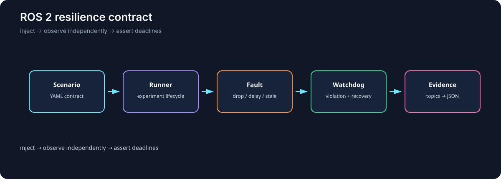

# ROS 2 Resilience Harness

Closed-loop ROS 2 regression harness that injects communication faults, checks independent evidence, and fails when recovery misses explicit deadlines.



## Why I Built It

Fault injection alone is not validation. I wanted each trial to define what a handled fault means, observe the effect through an independent stream, and produce a machine-checkable PASS or FAIL rather than trusting a component's self-report.

## What It Does

The harness runs dropout, latency, stale-hold, and healthy-control scenarios against a real ROS 2 Jazzy graph. A YAML contract defines the expected degradation, watchdog reason, recovery command, observed robot state, and deadlines. Each run writes measured evidence to JSON.

## Key Engineering Work

- Kept scenario validation, lifecycle state, faults, metrics, and assertions in pure Python.
- Added ROS adapters for the robot, fault injector, watchdog, runner, and batch CLI.
- Independently confirmed fault effects through raw/faulted stream comparisons.
- Observed recovery on `/cmd_vel` instead of accepting the watchdog's publish claim.
- Added mutation coverage for false self-reported recovery.
- Added 184 unit tests, end-to-end trials, and a multi-process launch test.

## Architecture

```text
YAML contract → experiment runner → fault injector → watchdog → recovery command
      │              │                  │              │
      └──────────────┴──── observed ROS graph + evidence ────► assertions → JSON
```

The `core/`, `faults/`, `robot/`, and `health/` packages have no `rclpy` dependency. ROS is an adapter around deterministic logic, which keeps most regressions fast to test.

## Results

In the shipped dropout scenario, the injector dropped 17 of 20 messages. The watchdog detected `loss_fraction_exceeded` in 0.552 s, the recovery command was observed in 0.0070 s, and the robot reached a stopped state in 0.597 s. A mutation test that suppresses the actual `/cmd_vel` publish fails the independent recovery assertions as intended.

The scope is one host with `use_sim_time=false`; trials run sequentially in one process except for the dedicated multi-process launch test. It is not a claim about multi-host timing or physical hardware safety.

## Tech Stack

ROS 2 Jazzy, Python, rclpy, `launch_testing`, Docker, pytest, YAML, and colcon.

## Running Locally

The supported environment is Ubuntu 24.04 with ROS 2 Jazzy. On other hosts, use the Jazzy container:

```bash
docker run --rm -it \
  --mount type=bind,source="$PWD",target=/workspace/src/ros2_resilience \
  --workdir /workspace \
  ros:jazzy-ros-base-noble bash
```

Inside the container:

```bash
source /opt/ros/jazzy/setup.bash
cd /workspace
colcon build --symlink-install --packages-select ros2_resilience
source install/setup.bash
cd src/ros2_resilience
python3 -m pytest tests/unit -q
python3 -m pytest tests/integration/test_scenarios_end_to_end.py -q
launch_test tests/integration/test_launch_multiprocess.py
ros2 run ros2_resilience run_scenario \
  --scenario scenarios/dropout_burst.yaml \
  --repeat 5 \
  --output results/dropout_burst.json
```

Apache-2.0 License.
